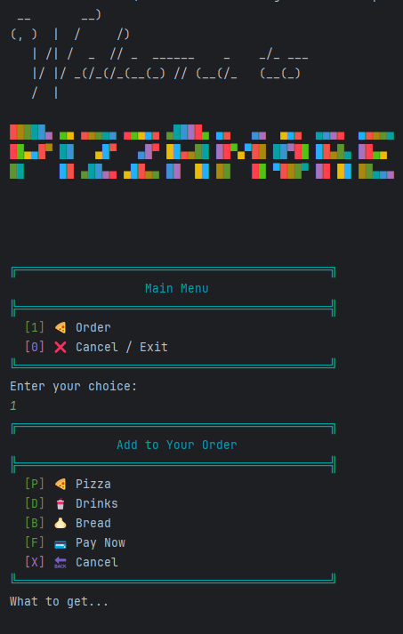
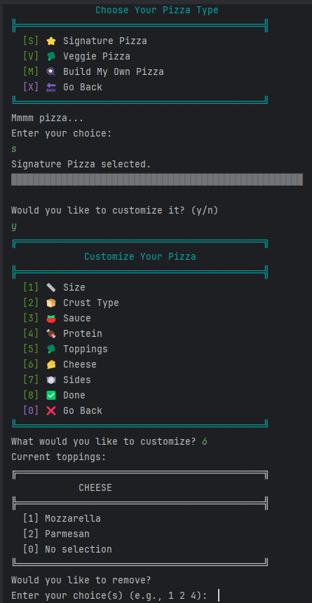
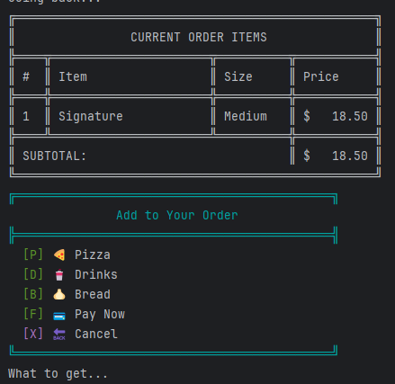
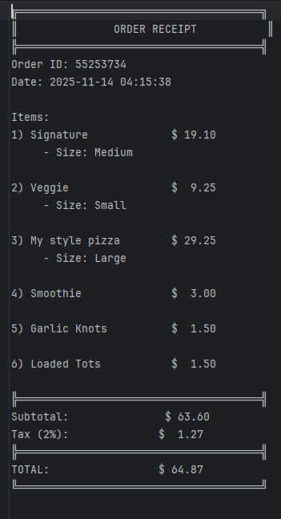
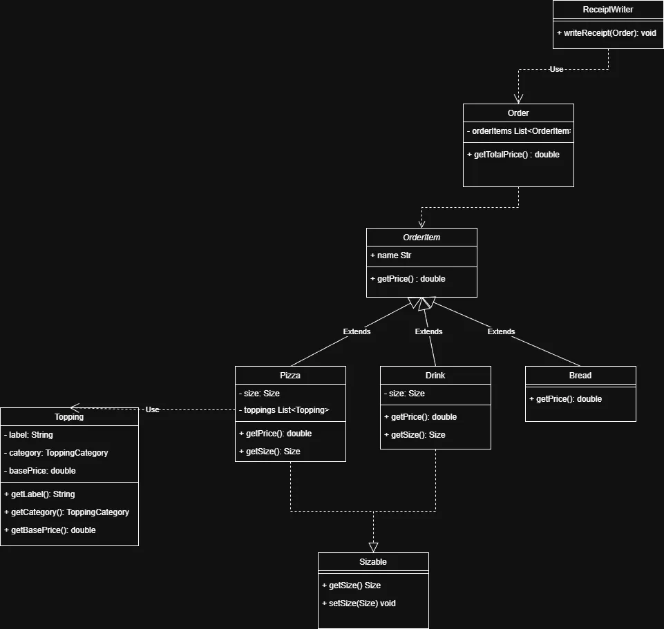

# 🍕 PizzAmore – Interactive Pizza Ordering CLI App

PizzAmore is a Java-based Command-Line Interface (CLI) restaurant ordering system that allows customers to craft custom pizzas, add sides and drinks, review orders in real time, and generate beautifully formatted receipt files. The application simulates a real ordering experience with menus, dynamic pricing, toppings logic, and full order summaries.

All completed orders are saved as receipt files in the /receipts folder using timestamps
(yyyyMMdd-hhmmss.txt) ensuring every order is stored uniquely and persistently.
---

## 🌟 Project Overview

PizzAmore allows users to:
- Build custom pizzas step-by-step (size, crust, sauce, toppings, sides).
- Add multiple items to an order (pizzas, drinks, breadsticks).
- Customize toppings on existing pizzas (add/remove).
- View the current order live in a neatly formatted summary table.
- Finalize and generate printable receipt files.
- Enjoy an enhanced CLI experience with menus, colors, and ASCII graphics.
---



## ✨ Key Features & Screens

### 🍕 Build-Your-Pizza Menu

Users can customize:

- Size (Small, Medium, Large)
- Crust Type
- Sauce Type
- Premium Toppings
- Cheese Toppings
- Regular Toppings
- Sides (optional)

The CLI walks the customer through each choice.

---



### 🧾 Order Summary Screen
---



### 📄 Receipt Generation




## 💻 Interesting Code Segment: Modular Topping Pricing Logic

Topping cost calculation varies depending on pizza size and topping category (premium / cheese).
### 🔍 Code Snippet

```java
        if (!premium.isEmpty()) {
            double base = premium.get(0).getBasePrice() * multiplier;
            total += base;

            for (int i = 1; i < premium.size(); i++) {
                total += base * 0.5;
            }
        }
```

---

### 🧪 Included Tests
You'll find tests for:

#### ✔ Pricing Tests

- Premium toppings logic
- Cheese topping logic
- Size multipliers
- Zero toppings edge cases

#### ✔ Topping Enum Tests

- fromInput("pepperoni") → Topping.PEPPERONI 
- Invalid strings → null

#### ✔ Input Parsing Tests

For method:

```public List<String> getValidInput(String input)```


Tests validate:
- Multi-digit messy strings 
- Symbol filtering 
- Empty input 
- Single-digit input

### 🧩 Technologies Used

- Java 17+ 
- JUnit 5 (for testing)
- ANSI Escape Colors for rich CLI menus 
- File I/O for receipt generation

### 📐 UML Diagrams

***Below are the primary UML diagrams representing the architecture of the PizzAmore system.***
---

**Attribution**: *Portions of this README were generated with the assistance of *ChatGPT (GPT-4)*, developed by [OpenAI](https://openai.com/), in **November 2025**. For more information, visit [https://openai.com/chatgpt](https://openai.com/chatgpt).*